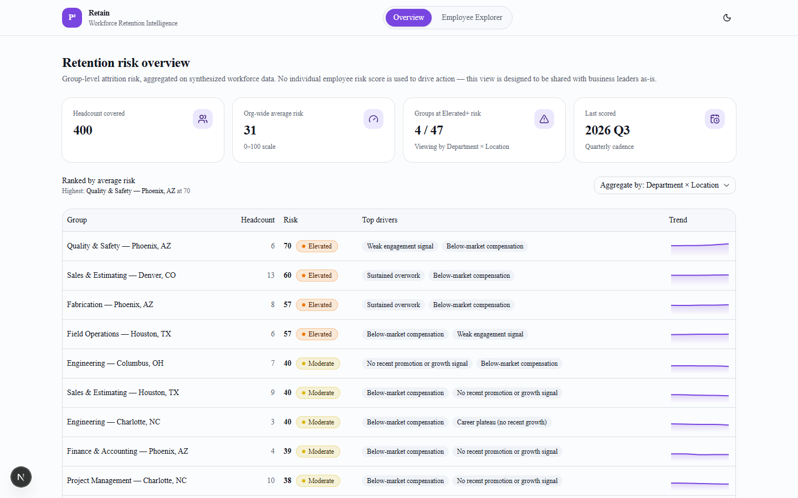
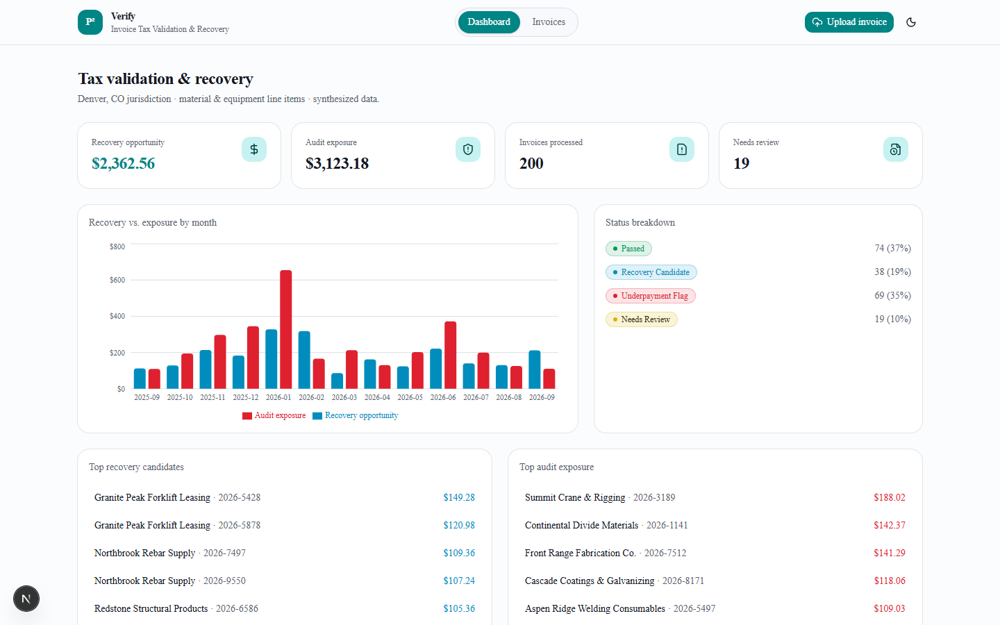
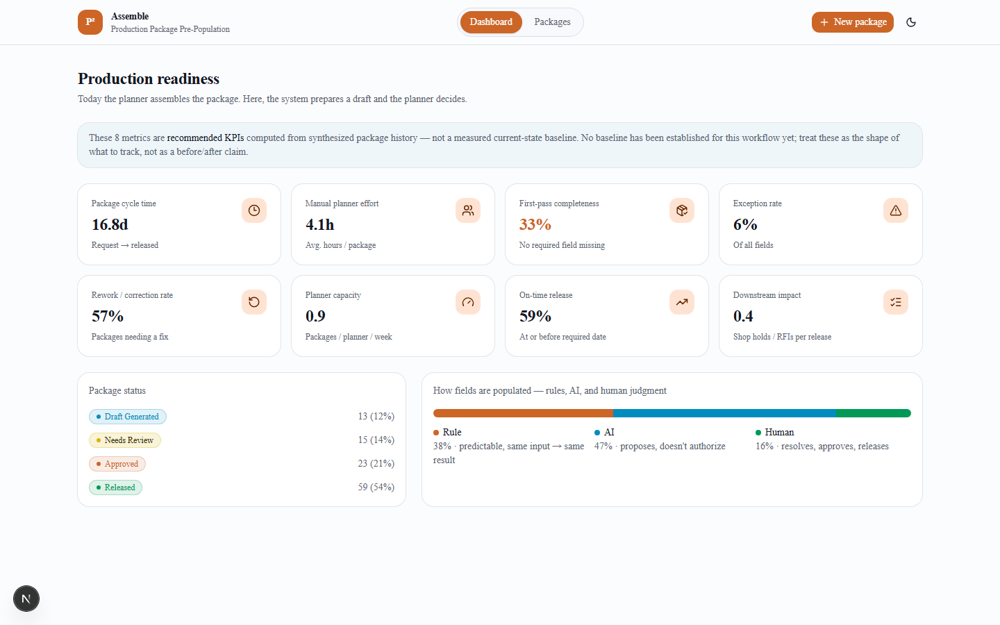
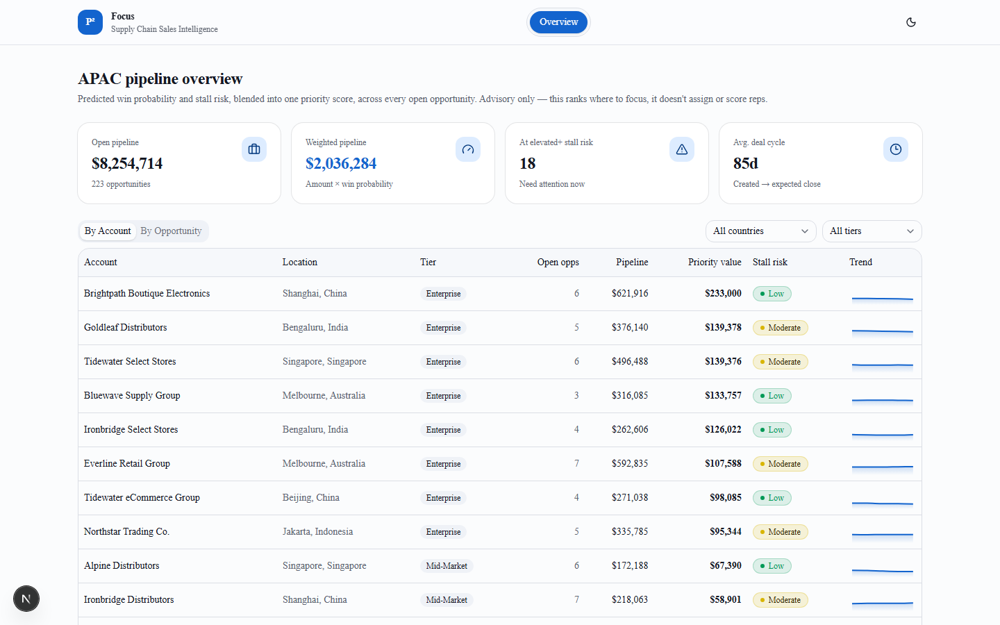

# P² Suite

Four working product prototypes, each taking a one-line problem statement from a different business domain — HR, finance, operations, sales — to a full working app: a scoring model, a synthetic dataset, and a polished UI, in a shared design system.

**Built end-to-end with [Claude Code](https://claude.com/claude-code), directed by me.** I defined the product scope, the data model, the scoring logic, the UX decisions, and the guardrails for each app; Claude Code implemented, tested, and iterated on the code under that direction. This repo is as much a demonstration of *product thinking translated into working software via an AI coding agent* as it is of the apps themselves — increasingly the actual job of a PM working alongside AI tools.

| | | |
|---|---|---|
|  |  | |
|  |  | |

## The four apps

| App | Folder | What it does |
|---|---|---|
| **P² Retain** | [`hr-retention/`](hr-retention/) | Predicts workforce attrition risk and rolls it up to **group level** (department, location, job role) for HR and business leadership, with driver factors in plain language and ranked retention recommendations — never a named individual. |
| **P² Verify** | [`finance-tax-recovery/`](finance-tax-recovery/) | Validates invoice line items against jurisdiction tax rules, flagging both **recovery opportunities** (overpaid) and **audit exposure** (underpaid), with every figure traceable to the rule that produced it. |
| **P² Assemble** | [`steel-production-planning/`](steel-production-planning/) | Auto-assembles a draft production package from scattered source data, tagging every field **Rule-derived / AI-suggested / Human-entered**, and routes exceptions to a planner instead of guessing. |
| **P² Focus** | [`sales-intelligence/`](sales-intelligence/) | Blends win probability and stall risk into one priority score across an open sales pipeline, so regional leadership can see which deals — and accounts — actually deserve attention. |

Each app is fully independent (own `package.json`, own seeded dataset, own port) — there's no shared backend between them, by design.

## Why these four, and why this shape

Each app started from a single sentence of context — not a full spec — which is deliberately close to how early-stage product problems actually show up. The interesting work was in the gap between that sentence and a working app: what's the actual data model, what does a defensible-but-honest "AI score" look like when there's no real ML model behind it, where does the human have to stay in the loop, and what does "good enough to demo" mean for a business stakeholder who's never seen the underlying data.

A few decisions show up in all four, on purpose:

- **Every score is a transparent, hand-specified formula** (see each app's `lib/scoring.ts`), never a black box — chosen so any number on screen can be manually verified against the fields that produced it. These are UX/workflow prototypes, not real ML systems, and they say so.
- **Advisory, not autonomous.** Nothing here writes to a system of record or takes an action on its own. Every workflow ends in a human decision — approve, release, resolve, investigate.
- **Synthesized data, seeded and reproducible.** `npm run seed` regenerates each dataset deterministically — open the JSON and see exactly what's being demoed.
- **One shared design language, four accent colors.** Same neutral palette, dark/light theming, and component patterns across all four, so they read as a suite rather than four unrelated demos.

## Running an app

```bash
cd <app-folder>
npm install
npm run seed   # regenerates that app's synthetic dataset deterministically
npm run dev
```

Each defaults to `http://localhost:3000` — pass `-- --port 3001` (etc.) to run more than one at once.

## Stack

Next.js (App Router) + TypeScript + Tailwind CSS + shadcn/ui (Radix/Base UI primitives) + Recharts + `next-themes`, per app.
